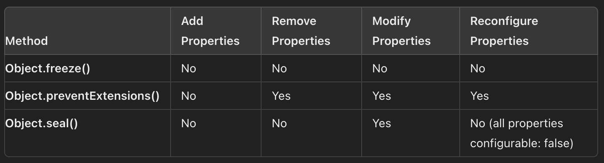

| Method                         | Add Properties | Remove Properties | Modify Properties | Reconfigure Properties                  |
| ------------------------------ | -------------- | ----------------- | ----------------- | --------------------------------------- |
| **Object.freeze()**            | No             | No                | No                | No                                      |
| **Object.preventExtensions()** | No             | Yes               | Yes               | Yes                                     |
| **Object.seal()**              | No             | No                | Yes               | No (all properties configurable: false) |



### Object.freeze()

_Description:_ Makes an object completely immutable.

_Effects:_

- Cannot add properties: New properties cannot be added to the object.
- Cannot remove properties: Existing properties cannot be deleted.
- Cannot modify properties: Values of existing properties cannot be changed.
- Cannot reconfigure properties: The descriptors of existing properties (writable, configurable, etc.) cannot be changed.

_Use case:_ When you want to ensure that an object is completely unchangeable.

```
const obj = { a: 1 };
Object.freeze(obj);

obj.a = 2;          // No effect
obj.b = 3;          // No effect
delete obj.a;       // No effect
```

### Object.preventExtensions()

_Description:_ Prevents the addition of new properties to an object.

_Effects:_

- Cannot add properties: New properties cannot be added to the object.
- Can remove properties: Existing properties can be deleted.
- Can modify properties: Values of existing properties can be changed.
- Can reconfigure properties: The descriptors of existing properties can be changed (if they are configurable).

_Use case:_ When you want to prevent new properties from being added but still allow modifications and deletions of existing properties.

```
const obj = { a: 1 };
Object.preventExtensions(obj);

obj.a = 2;          // Allowed
obj.b = 3;          // No effect
delete obj.a;       // Allowed

```

### Object.seal()

_Description:_ Prevents the addition or removal of properties but allows the modification of existing properties.

_Effects:_

- Cannot add properties: New properties cannot be added to the object.
- Cannot remove properties: Existing properties cannot be deleted.
- Can modify properties: Values of existing properties can be changed.
- Cannot reconfigure properties: The descriptors of existing properties (configurable) are set to false, but the writable attribute remains as is.

_Use case:_ When you want to allow modifications to existing properties but prevent the addition or removal of properties.

```
const obj = { a: 1 };
Object.seal(obj);

obj.a = 2;          // Allowed
obj.b = 3;          // No effect
delete obj.a;       // No effect

```
